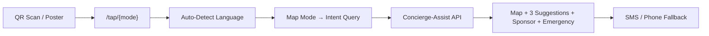
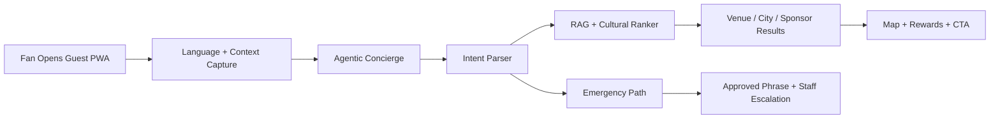
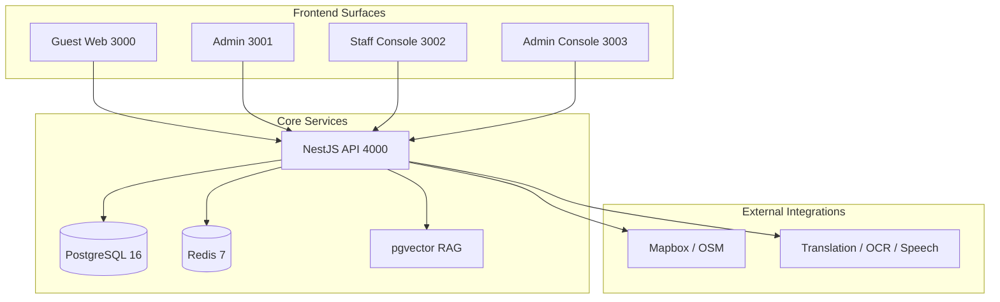
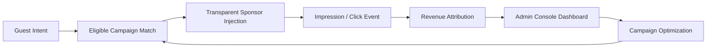

# FIFA---Wilkins


> FTHTrading x Wilkins Media Global Guest OS for the Atlanta-area FIFA moment: a production-grade, white-label multilingual fan operations platform with live wayfinding, cultural concierge, deterministic safety flows, sponsor monetization, and operator analytics.

## Table Of Contents

1. [System Snapshot](#system-snapshot)
2. [Color-Coded Stack](#color-coded-stack)
3. [Tap FIFA Live Flow](#tap-fifa-live-flow)
4. [One-Button Activation](#one-button-activation)
5. [Live Demo Surfaces](#live-demo-surfaces)
6. [Architecture Flowcharts](#architecture-flowcharts)
7. [Repository Map](#repository-map)
8. [White-Label Branding](#white-label-branding)
9. [GitHub Pages Demo](#github-pages-demo)
10. [Environment And Infra](#environment-and-infra)
11. [API And Monetization](#api-and-monetization)
12. [Operations Docs](#operations-docs)
13. [Push To GitHub](#push-to-github)

## System Snapshot

This repository is set up to demo and operate a FIFA-ready guest experience for Atlanta with four live surfaces and a shared API/data plane:

- Guest PWA for fans in 10 languages
- Staff console for translated assistance and escalation
- Admin console for campaign and revenue reporting
- Admin CMS for venue, translation, and event operations
- NestJS API with pgvector RAG, sponsor injection, WebSockets, PostgreSQL, and Redis

| Surface | Port | Outcome |
|---|---:|---|
| Guest Web | `3000` | Fan map, concierge, rewards, translation, emergency |
| Admin | `3001` | Event ops, POIs, emergency phrases, translation review |
| Staff Console | `3002` | Queue handling, quick replies, incident support |
| Admin Console | `3003` | Revenue, campaign performance, language and intent analytics |
| API | `4000` | REST, WebSockets, Swagger, orchestration |
| PostgreSQL | `5432` | Tenant, event, venue, rewards, campaign, RAG data |
| Redis | `6379` | Queueing, cache, translation jobs |

## Color-Coded Stack

| Zone | Color | Hex | Responsibility |
|---|---|---|---|
| Guest Experience | Blue | `#3B82F6` | PWA, map, rewards, translation, event UX |
| Staff Operations | Emerald | `#22C55E` | Guest assistance, escalations, queue workflows |
| Admin / Control | Violet | `#7C3AED` | Content operations, approvals, event control |
| Sponsor / Revenue | Fuchsia | `#C026D3` | Campaigns, monetization, premium placements |
| AI / Agentic | Amber | `#D97706` | Intent parsing, RAG, cultural ranking |
| Safety / Emergency | Red | `#EF4444` | Approved phrases, medical routing, alerts |
| Data / Storage | Slate | `#334155` | PostgreSQL, Redis, analytics, logs |
| Integration | Orange | `#EA580C` | Mapbox, OCR, voice, translation providers |

## Tap FIFA Live Flow

The commercial proof point: QR scan to instant multilingual event navigation.

**One scan, one number, one multilingual guest system. Tap FIFA guides the fan through the event and turns every useful moment into measurable sponsor value.**

### Routes

| URL | What It Does |
|---|---|
| `/tap/directions?zone=stadium_gate_c&lang=en` | Instant directions to a gate, seat, or exit |
| `/tap/food?lang=es` | Nearby food and restaurants in Spanish |
| `/tap/rewards?lang=pt` | Badges, challenges, and perks in Portuguese |
| `/tap/help?lang=ar` | Medical/security assistance in Arabic |
| `/tap/vip?lang=fr` | Premium access and exclusive offers in French |
| `/tap` | Mode picker with all five options |
| `/tap/posters` | Printable QR poster generator (5 posters) |

### Flow



### What The Guest Sees

1. Dark branded map with color-coded pins
2. "Next Step" overlay on the map surface
3. Top 3 ranked suggestions (venue, nearby, or geocoded)
4. 1 sponsor/reward card (highest-priority active campaign)
5. Emergency assistance button (pulsing, unmissable)
6. SMS + call fallback to **1-888-827-3432**

### File Map

```text
apps/web/
  app/tap/
    layout.tsx              standalone entry layout (no bottom nav)
    page.tsx                mode picker landing
    [mode]/page.tsx         auto-search by mode → results view
    posters/page.tsx        printable QR poster generator
  components/tap/
    tap-intent-map.ts       mode → API query mapping + language detection
    tap-results-view.tsx    map + suggestions + sponsor + emergency + SMS
```

## One-Button Activation

The fastest local path on Windows is the FTHTrading launcher:

```powershell
pnpm activate:fth
```

What it does:

1. Copies the active white-label brand pack into the Pages demo.
2. Creates `.env` from `.env.example` if needed.
3. Installs dependencies unless you skip install.
4. Starts PostgreSQL and Redis with Docker Compose.
5. Generates Prisma client, runs migrations, and seeds Atlanta demo data.
6. Starts the full Turborepo dev stack in a new PowerShell window.
7. Opens the key demo URLs in your browser.

Direct launcher usage:

```powershell
.\scripts\activate-wilkins.ps1 -Brand fthtrading-fifa-wilkins
```

Useful switches:

- `-NoBrowser` to skip opening URLs
- `-SkipInstall` to skip `pnpm install`
- `-PagesOnly` to sync branding into the Pages demo without starting the stack

## Live Demo Surfaces

| Surface | URL | Demo Value |
|---|---|---|
| **Tap FIFA** | `http://localhost:3000/tap/directions` | **QR → instant map + directions + sponsor** |
| **Tap Posters** | `http://localhost:3000/tap/posters` | **Printable QR campaign assets** |
| Guest Experience | `http://localhost:3000` | Multilingual navigation, concierge, rewards, sponsor placements |
| Map Experience | `http://localhost:3000/event/map` | Venue discovery, sponsor cards, cultural POIs |
| Admin Revenue | `http://localhost:3003/dashboard` | Revenue-forward executive summary |
| Full Analytics | `http://localhost:3003/analytics` | Revenue by language, intent, zone, campaign |
| Staff Operations | `http://localhost:3002` | Multilingual assistance queue |
| CMS / Control | `http://localhost:3001` | Event and content management |
| Swagger | `http://localhost:4000/docs` | API proof for technical buyers |

## Architecture Flowcharts

### End-To-End Guest Flow



### Platform And Infrastructure



### Sponsor Revenue Loop



For deeper diagrams, see [infra/diagrams/system-overview.mmd](infra/diagrams/system-overview.mmd) and [docs/architecture/system-overview.md](docs/architecture/system-overview.md).

## Repository Map

```text
apps/
  web/             guest PWA
  api/             NestJS + Prisma + WebSockets
  admin/           event operations CMS
  staff-console/   translator + assistance workflow
  admin-console/   revenue + campaign analytics

packages/
  agentic/         concierge logic and interfaces
  analytics/       reporting models
  campaigns/       sponsor rules and rewards
  config/          shared tailwind + tsconfig
  emergency/       deterministic safety language
  i18n/            locales and translation runtime
  lib/             utilities
  maps/            geo helpers and rankers
  types/           shared contracts
  ui/              design system

branding/
  brands/          white-label brand packs

docs/
  index.html       GitHub Pages demo site
  architecture/    system overview
  product/         positioning and demo script
  operations/      run guides
  api/             reference
```

## White-Label Branding

The repo now includes explicit brand packs for easy re-skinning and sales demos.

- Brand packs live in [branding/brands/default.json](branding/brands/default.json) and [branding/brands/fthtrading-fifa-wilkins.json](branding/brands/fthtrading-fifa-wilkins.json).
- The launcher copies the selected pack into `docs/brand.json` so the GitHub Pages demo instantly reflects the chosen client and event identity.
- This supports FTHTrading-owned demos today and straightforward conversion to new host cities, clubs, tournaments, or sponsors later.

Current default pack:

- Brand owner: `FTHTrading`
- Program: `FIFA x Wilkins`
- Market: `Atlanta, Georgia`
- Positioning: multilingual fan operations + sponsor monetization + safety layer

## GitHub Pages Demo

The repo includes a static demo site at [docs/index.html](docs/index.html) with:

- a branded hero
- architecture and infra sections
- color-coded capability cards
- live flowcharts rendered with Mermaid
- a commercial-ready overview for repo visitors and buyers

GitHub Actions deployment is configured in [.github/workflows/pages.yml](.github/workflows/pages.yml). Once GitHub Pages is enabled for the repository, pushes to `main` will publish the `docs/` folder.

## Environment And Infra

Base services come from [docker-compose.yml](docker-compose.yml):

- `postgres` for primary event and sponsor data
- `redis` for queueing and caching
- `api` for all business logic and integrations
- `web`, `admin`, `staff-console`, `admin-console` for the user-facing surfaces

Local boot prerequisites:

- Node.js 20+
- `pnpm` 9+
- Docker Desktop and Docker Compose

Environment variables are defined in [.env.example](.env.example).

## API And Monetization

Commercial proof points already surfaced in the product:

- multilingual intent engine across 10 languages
- deterministic emergency translations
- pgvector venue knowledge retrieval
- sponsor cards with transparent labeling
- rewards, badges, challenges, and coupon flows
- revenue dashboards by campaign, language, and intent

Key route groups:

- guest: `/api/v1/events`, `/api/v1/maps`, `/api/v1/agentic`, `/api/v1/translate`
- staff: `/api/v1/staff/queue`, `/api/v1/staff/respond`, `/api/v1/staff/escalate`
- campaigns: `/api/v1/campaigns/*`
- admin: `/api/v1/admin/*`

## Wilkins Media FIFA AI Connection System

Primary telecom entry number:

- `+1-888-827-3432`

Public CTA language:

- Text FIFA
- Tap FIFA
- Call FIFA

User-facing CTA copy:

```text
Need help, directions, food, rewards, or emergency support?

Text FIFA: +1-888-827-3432
```

Activation CTA copy:

```text
Tap FIFA to unlock offers and rewards.
Text FIFA for live help in your language.
```

Telecom integration summary:

- Telnyx inbound SMS webhooks route into `/api/v1/telecom/webhooks/telnyx/sms`
- Messages are language-detected and intent-classified through the existing multilingual engine
- Emergency intent is routed deterministically and sponsor logic is suppressed
- Concierge/reward/sponsor flows orchestrate existing `agentic`, `campaigns`, and `analytics` services
- Telecom analytics are first-class via `/api/v1/telecom/summary`

Required telecom env vars:

- `TELECOM_PROVIDER=telnyx`
- `TELNYX_API_KEY`
- `TELNYX_PHONE_NUMBER=+18888273432`
- `TELNYX_MESSAGING_PROFILE_ID` (recommended)
- `TELECOM_PUBLIC_BASE_URL` (for links in SMS)

Suggested Telnyx webhook targets:

- Inbound SMS: `https://<api-host>/api/v1/telecom/webhooks/telnyx/sms`
- Delivery updates: `https://<api-host>/api/v1/telecom/webhooks/telnyx/status`
- Voice scaffold: `https://<api-host>/api/v1/telecom/webhooks/telnyx/voice`

## Operations Docs

- [docs/product/overview.md](docs/product/overview.md)
- [docs/product/demo-script-5-minute.md](docs/product/demo-script-5-minute.md)
- [docs/product/pitch-deck-client.md](docs/product/pitch-deck-client.md)
- [docs/product/pricing-model.md](docs/product/pricing-model.md)
- [docs/product/sponsor-packages.md](docs/product/sponsor-packages.md)
- [docs/product/city-rollout-strategy.md](docs/product/city-rollout-strategy.md)
- [docs/operations/operations-guide.md](docs/operations/operations-guide.md)
- [docs/operations/telecom-setup.md](docs/operations/telecom-setup.md)
- [docs/api/api-reference.md](docs/api/api-reference.md)
- [docs/runbooks/incident-response.md](docs/runbooks/incident-response.md)

## Push To GitHub

The target remote for this repository is:

```bash
https://github.com/FTHTrading/FIFA---Wilkins.git
```

Recommended sequence after local review:

```bash
git init
git branch -M main
git remote add origin https://github.com/FTHTrading/FIFA---Wilkins.git
git add .
git commit -m "Launch FIFA Wilkins public repo"
git push -u origin main
```

## Infrastructure Hardening

This platform includes production-grade infrastructure, applied at the senior engineering level:

### API Security
- **RBAC Guard** + `@Roles()` decorator — role-based endpoint protection
- **Global ThrottlerGuard** — 20 req/sec burst, 200 req/min sustained
- **Login throttle** — 5 attempts/minute per IP
- **Request-ID middleware** — `x-request-id` propagation for distributed tracing
- **Logging interceptor** — structured HTTP logs with method, status, duration, requestId
- **Global exception filter** — structured error responses, 500 stack-trace logging
- **Graceful shutdown** — `enableShutdownHooks()` with proper signal handling
- **Security headers** — HSTS, CSP, X-Frame-Options, nosniff via Fastify Helmet + Nginx

### WebSocket Hardening
- Input validation on all gateway messages
- Per-client rate limiting (30 msg/min on chat)
- `WsException` for structured error feedback
- Heartbeat tuning (`pingInterval` / `pingTimeout`)
- `join_event` subscription for emergency staff monitoring

### Observability
- **Deep health check** — `/health` probes DB + Redis, reports version/env/uptime
- **Liveness probe** — `/health/live` for fast k8s checks
- **Prometheus-compatible metrics** — `/health/metrics` (heap, RSS, external, uptime)
- **Audit log** — `AuditLog` Prisma model + `AuditService` for admin action tracking

### Frontend Security
- HSTS, X-Frame-Options, X-Content-Type-Options, Referrer-Policy on all 4 frontends
- Permissions-Policy restricting camera/mic/geo per surface
- `poweredByHeader: false` on all Next.js apps

### CI/CD Pipeline
- PR concurrency groups — cancel stale runs
- `security` job — `pnpm audit --audit-level=high`
- Trivy container vulnerability scan with SARIF upload to GitHub Security tab
- Docker Buildx with GitHub Actions cache

### Production Docker
- `docker-compose.prod.yml` overlay — resource limits, Redis maxmemory, replicas, JSON logging
- **Nginx reverse proxy** — rate limiting, WebSocket upgrade, gzip, security headers, static asset caching
- **dumb-init** — proper PID 1 signal handling in API container

### Environment Validation
- `verify-env.ts` validates DATABASE_URL format, REDIS_PORT range, JWT_SECRET length, Mapbox token prefix
- Production-only checks: rejects weak JWT secrets and localhost DATABASE_URL